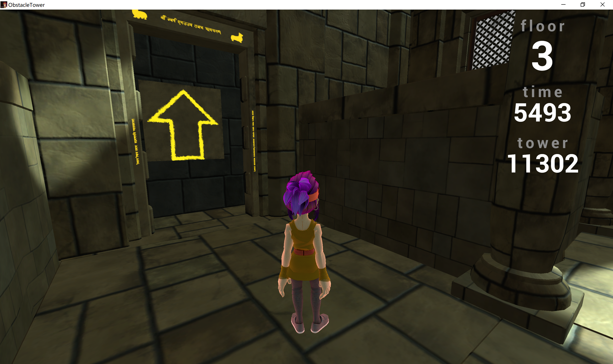
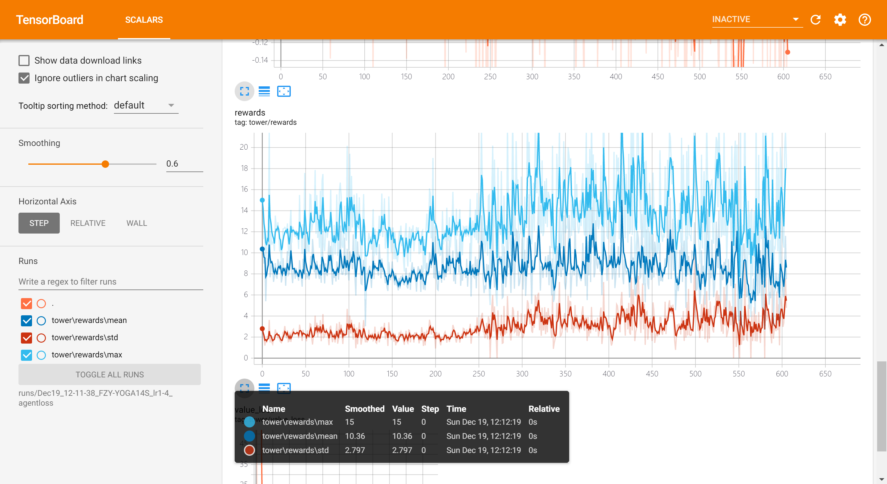
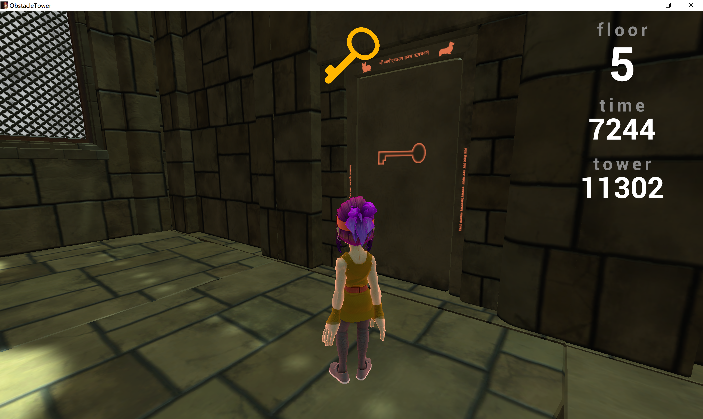

# Obstacle Tower Challenge using Deep Reinforcement Learning 
Unity Obstacle Tower is a challenging realistic 3D, third person perspective and procedurally generated environment, which we use as the benchmark to test the performance of our deep RL models. 

Proximal Policy Optimization (PPO) and Advantage Actor Critic (A2C), both combined with Intrinsic Curiosity Model (ICM), are implemented. We train our agent using both PPO and A2C while calculating several metrics such as loss function and reward to evaluate these two methods. 

More details regrading this project can be viewed in our [paper](https://drive.google.com/file/d/1ANcB1z1u9EiEo4aXfQlaDinZbaadI4Oj/view).

  

## Dependencies

Requirements: see  `requirements.txt`. We also require `python 3.5+` and `pip`.

Install dependencies with `pip install -r requirements.txt`.

Download the environment  at Obstacle Tower Github page [here](https://github.com/Unity-Technologies/obstacle-tower-env), unzip it and place it into the root of the project.  

## Training an agent

#### Run

Run `python3 -m agent.learn`. This will initialize training with default parameters and it will use A2C as a learning method. 

Run `python3 -m agent.learn -h` to check all options and their description.  

#### Visualization

Training can be visualized with *TensorboardX*.  
After initial collection of observation stops and training starts, a log file that recording the data during the training process will be created in the `runs`/ file.

Run `tensorboard --logdir runs/<file_name>`. This will start server on `localhost:6006` by default.

For example, you can run  `tensorboard --logdir runs/a2c` to see the visualization results of a training process using the given a2c model.

Here is a screenshot of the visualization example:

## Running the agent
Run `python3 -m runner --model_name <model_name>`  This will start inference mode with selected model. 

Two pretrained sample models are placed in `models/` directory.
To check all available options run `python3 -m runner -h`.  
Agent runs until in-game time runs up.

For example, you can run  `python -m runner --model_name model_a2c_750.bin`  using the given sample model.

Here is a screenshot of a single run:

